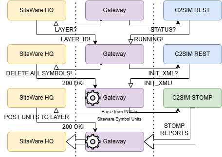

# C2SIM Gateway to SitaWare HQ Gateway

The gateway ingests C2SIM XML (initialisation + live PositionReports) from the C2SIM server STOMP broker, translates each unit to an SitaWare symbol, and publishes it to a writable layer on SitaWare HQ.  It is designed for experimentation environments where the simulation drives the COP but SitaWare must up to date. The bridge is **unidirectional by default**.

---

## Features

- **Unidirectional data bridge** – Real-time position updates on SitaWare HQ from C2SIM STOMP reports
- **Automated unit translation** – APP‑6C SIDC, geometry, names and health are derived from C2SIM XML.
- **Secure authentication** – optional Keycloak/OpenID Connect bearer‑token flow for REST calls to the C2SIM server.
- **Operator console** – lightweight PyQt GUI to load YAML configs, start/stop the bridge.

---

## Architecture



1. **C2SIM server** (REST + STOMP) hosts the exercise ground truth.
2. **Gateway** polls REST for `QUERYINIT`, connects to STOMP, and converts messages with the `Parser`.
3. **SitaWare HQ** the gateway caches a writable layer and POSTs symbols there.

---

## Quick start

### 1 Prerequisites

| Requirement         | Version tested |
| ------------------- | -------------- |
| Python              |  3.11          |
| SitaWare HQ         |  6.18          |
| C2SIM server        |  4.8.4.9       |
| Keycloak (optional) |  22.x          |

### 2 Clone & install

```bash
$ git clone https://github.com/<your‑org>/swhq‑c2sim‑gateway.git
$ cd swhq‑c2sim‑gateway
$ python -m venv .venv && source .venv/bin/activate  # Windows: .venv\Scripts\activate
$ pip install -r requirements.txt
```

### 3 Configure

1. Copy `config.yaml.example` ➜ `config.yaml`.
2. Edit the following keys:

```yaml
sitaware:
  host: 11.11.11.11
  username: apiuser
  password: secret
  layer_folder: default      # folder part of layer ID
  layer_name: c2sim‑gateway  # name part of layer ID

c2sim_server:
  host: 11.11.11.11
  rest_port: 12
  stomp_port: 123
  use_oidp: true

oidp:
  host: 11.11.11.11
  port: 12
  client_id: Jeff
  client_secret: <client‑secret>
```

### 4 Create a writable layer in SitaWare

### 5 Run

#### Start GUI

```bash
python main.py
```

Logs rotate in `sw_c2sim_gw_startup.log` (10 MiB max in config).

